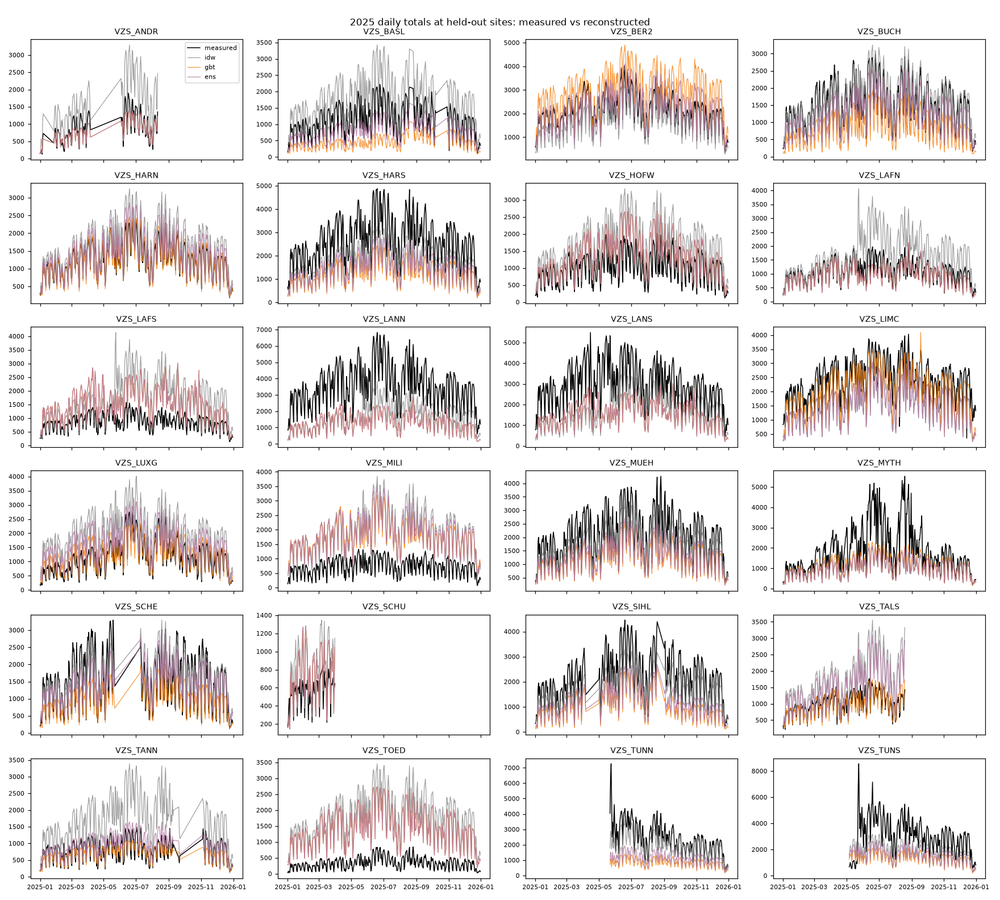
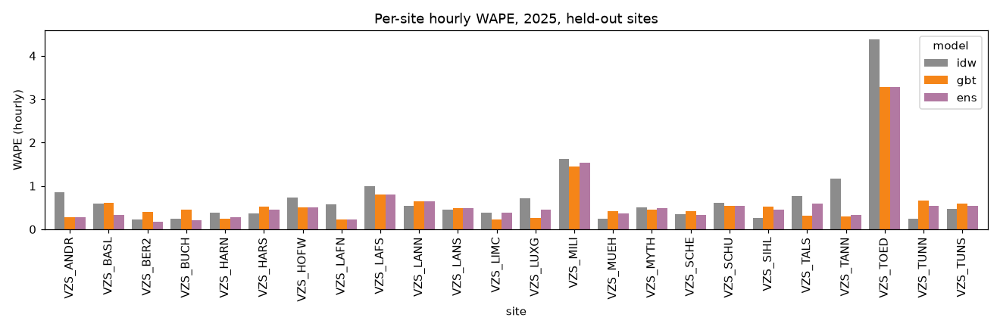
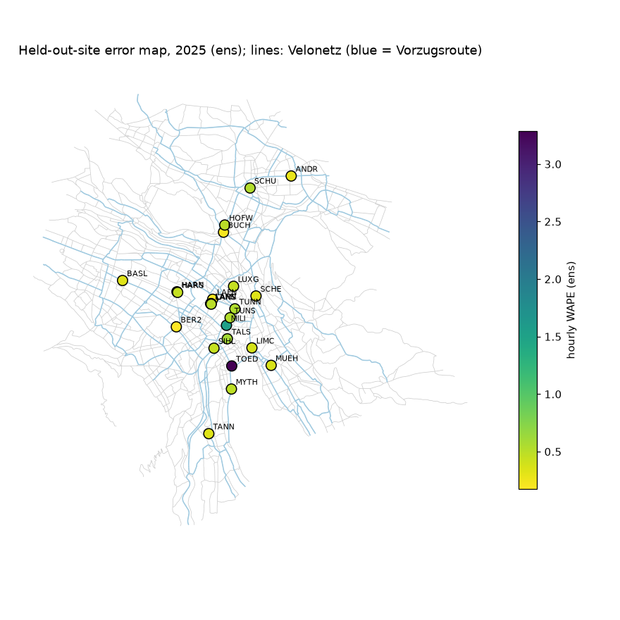

# Held-out-counter backtest: `blend`

Retrospective **spatial reconstruction** of 2025 hourly bicycle passages at each held-out city counter from contemporaneous counts at the other counters, weather, calendar and network covariates. Raw recorded passages (no correction factors). Static current OSM network. Not a forecast.

Folds: 20 hold-out groups; evaluation hours: complete, non-DST-ambiguous, non-flagged; all models compared on identical site-hours.

## Aggregate (pooled over all held-out site-hours)
| model   |      n |   MAE |   RMSE |   bias |   WAPE |   mean_obs |
|:--------|-------:|------:|-------:|-------:|-------:|-----------:|
| idw     | 184263 | 35.45 |  55.92 |   0.53 |   0.52 |      68.73 |
| gbt     | 184263 | 35.22 |  59.04 | -15.79 |   0.51 |      68.73 |
| ens     | 184263 | 33.25 |  55.97 | -11.98 |   0.48 |      68.73 |

## Macro average across sites
| model   |   MAE |   RMSE |   bias |   WAPE |
|:--------|------:|-------:|-------:|-------:|
| idw     | 34.63 |  51.05 |   1.17 |   0.73 |
| gbt     | 34.45 |  50.36 | -16.3  |   0.61 |
| ens     | 32.51 |  47.72 | -12.02 |   0.59 |

## Daily totals (days with 24 evaluated hours)
| model   |    n |    MAE |    RMSE |    bias |   WAPE |   mean_obs |
|:--------|-----:|-------:|--------:|--------:|-------:|-----------:|
| idw     | 7627 | 807.75 | 1014.82 |   13.09 |   0.49 |    1651.59 |
| gbt     | 7627 | 791.44 | 1075.58 | -379.78 |   0.48 |    1651.59 |
| ens     | 7627 | 748.09 | 1017.55 | -287.97 |   0.45 |    1651.59 |

## Validation (2024, validation sites) MAE, mean over folds
|     |   val_MAE |
|:----|----------:|
| idw |     32.46 |
| gbt |     31.04 |
| ens |     28.85 |

## Prediction-interval coverage (intervals from validation residuals)
| model   |   nominal 80% |   nominal 90% |
|:--------|--------------:|--------------:|
| idw     |         0.681 |         0.775 |
| gbt     |         0.7   |         0.798 |
| ens     |         0.68  |         0.771 |

## Week-block bootstrap of pooled MAE differences (95% CI)
|                |   mae_diff_a_minus_b |   ci95_lo |   ci95_hi |
|:---------------|---------------------:|----------:|----------:|
| ('gbt', 'idw') |                -0.22 |     -0.88 |      0.48 |
| ('ens', 'idw') |                -2.2  |     -2.65 |     -1.72 |
| ('ens', 'gbt') |                -1.98 |     -2.25 |     -1.7  |

## By season
| season        |   ('MAE', 'ens') |   ('MAE', 'gbt') |   ('MAE', 'idw') |   ('WAPE', 'ens') |   ('WAPE', 'gbt') |   ('WAPE', 'idw') |   ('bias', 'ens') |   ('bias', 'gbt') |   ('bias', 'idw') |
|:--------------|-----------------:|-----------------:|-----------------:|------------------:|------------------:|------------------:|------------------:|------------------:|------------------:|
| spring/autumn |            33.76 |            35.92 |            35.68 |              0.48 |              0.51 |              0.51 |            -12.03 |            -15.59 |             -0.66 |
| summer        |            42.63 |            44.36 |            45.88 |              0.49 |              0.51 |              0.53 |            -15.64 |            -21.42 |              3.69 |
| winter        |            22.41 |            24.29 |            24.05 |              0.48 |              0.52 |              0.52 |             -8.06 |            -10.27 |             -0.47 |

## By daytype
| daytype         |   ('MAE', 'ens') |   ('MAE', 'gbt') |   ('MAE', 'idw') |   ('WAPE', 'ens') |   ('WAPE', 'gbt') |   ('WAPE', 'idw') |   ('bias', 'ens') |   ('bias', 'gbt') |   ('bias', 'idw') |
|:----------------|-----------------:|-----------------:|-----------------:|------------------:|------------------:|------------------:|------------------:|------------------:|------------------:|
| weekend/holiday |            25.88 |            26.56 |            28.82 |              0.54 |              0.55 |              0.6  |             -8.82 |            -11.94 |              1.12 |
| workday         |            36.56 |            39.12 |            38.43 |              0.47 |              0.5  |              0.49 |            -13.4  |            -17.52 |              0.27 |

## By peak
| peak     |   ('MAE', 'ens') |   ('MAE', 'gbt') |   ('MAE', 'idw') |   ('WAPE', 'ens') |   ('WAPE', 'gbt') |   ('WAPE', 'idw') |   ('bias', 'ens') |   ('bias', 'gbt') |   ('bias', 'idw') |
|:---------|-----------------:|-----------------:|-----------------:|------------------:|------------------:|------------------:|------------------:|------------------:|------------------:|
| off-peak |            26.29 |            27.56 |            28.43 |              0.51 |              0.53 |              0.55 |             -9.33 |            -12.27 |              0.63 |
| peak     |            74.69 |            80.89 |            77.27 |              0.44 |              0.48 |              0.45 |            -27.8  |            -36.76 |             -0.03 |

## By stadttunnel
| stadttunnel       |   ('MAE', 'ens') |   ('MAE', 'gbt') |   ('MAE', 'idw') |   ('WAPE', 'ens') |   ('WAPE', 'gbt') |   ('WAPE', 'idw') |   ('bias', 'ens') |   ('bias', 'gbt') |   ('bias', 'idw') |
|:------------------|-----------------:|-----------------:|-----------------:|------------------:|------------------:|------------------:|------------------:|------------------:|------------------:|
| after 22 May 2025 |            36.32 |            38.79 |            38    |              0.48 |              0.52 |              0.51 |            -13.8  |            -18.38 |              2.51 |
| before            |            28.35 |            29.54 |            31.37 |              0.48 |              0.5  |              0.53 |             -9.08 |            -11.66 |             -2.61 |

## Per-site hourly MAE
| site     |   idw |   gbt |   ens |
|:---------|------:|------:|------:|
| VZS_ANDR | 31.43 | 10.32 | 10.32 |
| VZS_BASL | 27.68 | 27.94 | 15.19 |
| VZS_BER2 | 20.64 | 34.77 | 15.4  |
| VZS_BUCH | 14.26 | 27.45 | 13.06 |
| VZS_HARN | 19.39 | 12.81 | 14.34 |
| VZS_HARS | 39.88 | 57.47 | 48.61 |
| VZS_HOFW | 30.38 | 20.57 | 20.57 |
| VZS_LAFN | 25.51 | 10.05 | 10.05 |
| VZS_LAFS | 35.24 | 28.97 | 28.97 |
| VZS_LANN | 78.33 | 93.89 | 93.89 |
| VZS_LANS | 56.03 | 60.69 | 60.69 |
| VZS_LIMC | 36.96 | 22.14 | 36.96 |
| VZS_LUXG | 34.64 | 12.35 | 21.43 |
| VZS_MILI | 49.26 | 43.58 | 46.42 |
| VZS_MUEH | 20.57 | 34.27 | 30.29 |
| VZS_MYTH | 38.77 | 34.8  | 37.72 |
| VZS_SCHE | 22.05 | 26.09 | 20.71 |
| VZS_SCHU | 14.14 | 12.49 | 12.49 |
| VZS_SIHL | 22.32 | 45.76 | 39.17 |
| VZS_TALS | 32    | 12.86 | 25.26 |
| VZS_TANN | 38.54 |  9.84 | 10.78 |
| VZS_TOED | 59.81 | 44.99 | 44.99 |
| VZS_TUNN | 23.69 | 66.1  | 54.84 |
| VZS_TUNS | 59.65 | 76.52 | 68.02 |

## Difficult sites (highest best-model MAE)
| site     |   best MAE |
|:---------|-----------:|
| VZS_LANN |      78.33 |
| VZS_TUNS |      59.65 |
| VZS_LANS |      56.03 |
| VZS_TOED |      44.99 |
| VZS_MILI |      43.58 |

