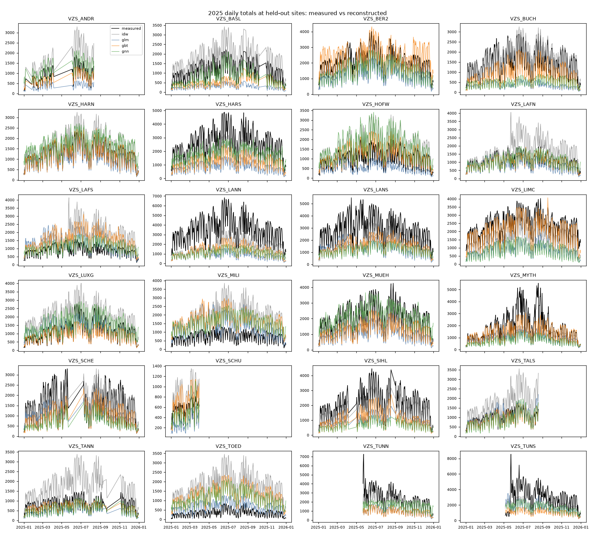
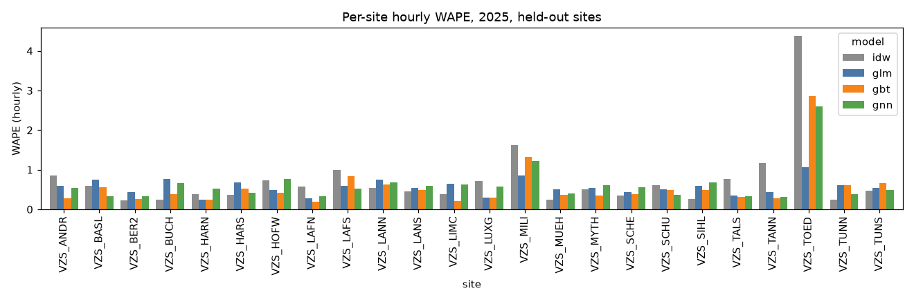

# Held-out-counter backtest: `intersection`

Retrospective **spatial reconstruction** of 2025 hourly bicycle passages at each held-out city counter from contemporaneous counts at the other counters, weather, calendar and network covariates. Raw recorded passages (no correction factors). Static current OSM network. Not a forecast.

Folds: 20 hold-out groups; evaluation hours: complete, non-DST-ambiguous, non-flagged; all models compared on identical site-hours.

## Aggregate (pooled over all held-out site-hours)
| model   |      n |   MAE |   RMSE |   bias |   WAPE |   mean_obs |
|:--------|-------:|------:|-------:|-------:|-------:|-----------:|
| idw     | 184263 | 35.45 |  55.92 |   0.53 |   0.52 |      68.73 |
| glm     | 184263 | 39.06 |  66.05 | -30.93 |   0.57 |      68.73 |
| gbt     | 184263 | 33    |  56.64 | -16.56 |   0.48 |      68.73 |
| gnn     | 184263 | 38.61 |  64.9  | -17.61 |   0.56 |      68.73 |

## Macro average across sites
| model   |   MAE |   RMSE |   bias |   WAPE |
|:--------|------:|-------:|-------:|-------:|
| idw     | 34.63 |  51.05 |   1.17 |   0.73 |
| glm     | 38.01 |  55.58 | -30.4  |   0.56 |
| gbt     | 32.45 |  47.71 | -17.12 |   0.56 |
| gnn     | 37    |  55.08 | -17.08 |   0.62 |

## Daily totals (days with 24 evaluated hours)
| model   |    n |    MAE |    RMSE |    bias |   WAPE |   mean_obs |
|:--------|-----:|-------:|--------:|--------:|-------:|-----------:|
| idw     | 7627 | 807.75 | 1014.82 |   13.09 |   0.49 |    1651.59 |
| glm     | 7627 | 909.77 | 1210.32 | -743.04 |   0.55 |    1651.59 |
| gbt     | 7627 | 725.99 | 1027.47 | -398.01 |   0.44 |    1651.59 |
| gnn     | 7627 | 825.88 | 1116.02 | -422.7  |   0.5  |    1651.59 |

## Validation (2024, validation sites) MAE, mean over folds
|     |   val_MAE |
|:----|----------:|
| idw |     32.46 |
| glm |     35.63 |
| gbt |     30.54 |
| gnn |     34.54 |

## Prediction-interval coverage (intervals from validation residuals)
| model   |   nominal 80% |   nominal 90% |
|:--------|--------------:|--------------:|
| idw     |         0.681 |         0.775 |
| glm     |         0.659 |         0.744 |
| gbt     |         0.715 |         0.804 |
| gnn     |         0.711 |         0.805 |

## Week-block bootstrap of pooled MAE differences (95% CI)
|                |   mae_diff_a_minus_b |   ci95_lo |   ci95_hi |
|:---------------|---------------------:|----------:|----------:|
| ('glm', 'idw') |                 3.61 |      2.83 |      4.48 |
| ('glm', 'gnn') |                 0.45 |     -0.06 |      0.96 |
| ('gbt', 'idw') |                -2.45 |     -3.16 |     -1.75 |
| ('gbt', 'glm') |                -6.06 |     -6.81 |     -5.42 |
| ('gbt', 'gnn') |                -5.61 |     -6.11 |     -5.11 |
| ('gnn', 'idw') |                 3.16 |      2.64 |      3.7  |

## By season
| season        |   ('MAE', 'gbt') |   ('MAE', 'glm') |   ('MAE', 'gnn') |   ('MAE', 'idw') |   ('WAPE', 'gbt') |   ('WAPE', 'glm') |   ('WAPE', 'gnn') |   ('WAPE', 'idw') |   ('bias', 'gbt') |   ('bias', 'glm') |   ('bias', 'gnn') |   ('bias', 'idw') |
|:--------------|-----------------:|-----------------:|-----------------:|-----------------:|------------------:|------------------:|------------------:|------------------:|------------------:|------------------:|------------------:|------------------:|
| spring/autumn |            33.47 |            40.51 |            39.32 |            35.68 |              0.47 |              0.57 |              0.56 |              0.51 |            -16.86 |            -31.69 |            -18.47 |             -0.66 |
| summer        |            41.43 |            47.82 |            47.88 |            45.88 |              0.48 |              0.55 |              0.55 |              0.53 |            -22.04 |            -38.98 |            -21.66 |              3.69 |
| winter        |            23.23 |            27.06 |            27.5  |            24.05 |              0.5  |              0.58 |              0.59 |              0.52 |            -10.22 |            -21.02 |            -11.69 |             -0.47 |

## By daytype
| daytype         |   ('MAE', 'gbt') |   ('MAE', 'glm') |   ('MAE', 'gnn') |   ('MAE', 'idw') |   ('WAPE', 'gbt') |   ('WAPE', 'glm') |   ('WAPE', 'gnn') |   ('WAPE', 'idw') |   ('bias', 'gbt') |   ('bias', 'glm') |   ('bias', 'gnn') |   ('bias', 'idw') |
|:----------------|-----------------:|-----------------:|-----------------:|-----------------:|------------------:|------------------:|------------------:|------------------:|------------------:|------------------:|------------------:|------------------:|
| weekend/holiday |            25.23 |            28.21 |            28.79 |            28.82 |              0.52 |              0.59 |              0.6  |              0.6  |            -12.26 |            -21.77 |            -11.89 |              1.12 |
| workday         |            36.49 |            43.93 |            43.02 |            38.43 |              0.47 |              0.56 |              0.55 |              0.49 |            -18.49 |            -35.05 |            -20.18 |              0.27 |

## By peak
| peak     |   ('MAE', 'gbt') |   ('MAE', 'glm') |   ('MAE', 'gnn') |   ('MAE', 'idw') |   ('WAPE', 'gbt') |   ('WAPE', 'glm') |   ('WAPE', 'gnn') |   ('WAPE', 'idw') |   ('bias', 'gbt') |   ('bias', 'glm') |   ('bias', 'gnn') |   ('bias', 'idw') |
|:---------|-----------------:|-----------------:|-----------------:|-----------------:|------------------:|------------------:|------------------:|------------------:|------------------:|------------------:|------------------:|------------------:|
| off-peak |            25.8  |            29.69 |            30.45 |            28.43 |              0.5  |              0.57 |              0.59 |              0.55 |            -13.03 |            -23.33 |             -9.76 |              0.63 |
| peak     |            75.88 |            94.86 |            87.2  |            77.27 |              0.45 |              0.56 |              0.51 |              0.45 |            -37.54 |            -76.21 |            -64.34 |             -0.03 |

## By stadttunnel
| stadttunnel       |   ('MAE', 'gbt') |   ('MAE', 'glm') |   ('MAE', 'gnn') |   ('MAE', 'idw') |   ('WAPE', 'gbt') |   ('WAPE', 'glm') |   ('WAPE', 'gnn') |   ('WAPE', 'idw') |   ('bias', 'gbt') |   ('bias', 'glm') |   ('bias', 'gnn') |   ('bias', 'idw') |
|:------------------|-----------------:|-----------------:|-----------------:|-----------------:|------------------:|------------------:|------------------:|------------------:|------------------:|------------------:|------------------:|------------------:|
| after 22 May 2025 |            36.1  |            42.56 |            41.56 |            38    |              0.48 |              0.57 |              0.55 |              0.51 |            -18.89 |            -35.99 |            -18.82 |              2.51 |
| before            |            28.05 |            33.48 |            33.89 |            31.37 |              0.48 |              0.57 |              0.58 |              0.53 |            -12.85 |            -22.86 |            -15.67 |             -2.61 |

## Per-site hourly MAE
| site     |   idw |    glm |   gbt |    gnn |
|:---------|------:|-------:|------:|-------:|
| VZS_ANDR | 31.43 |  21.69 | 10.37 |  19.7  |
| VZS_BASL | 27.68 |  34.51 | 25.63 |  15.48 |
| VZS_BER2 | 20.64 |  37.98 | 23.24 |  29.13 |
| VZS_BUCH | 14.26 |  46.41 | 23.32 |  40.13 |
| VZS_HARN | 19.39 |  12.2  | 12.25 |  26.61 |
| VZS_HARS | 39.88 |  74.64 | 57.35 |  44.82 |
| VZS_HOFW | 30.38 |  20.3  | 17.09 |  32.09 |
| VZS_LAFN | 25.51 |  12.78 |  8.9  |  15.01 |
| VZS_LAFS | 35.24 |  21.29 | 29.78 |  18.82 |
| VZS_LANN | 78.33 | 110.18 | 92.89 | 100.13 |
| VZS_LANS | 56.03 |  67.11 | 59.18 |  73.7  |
| VZS_LIMC | 36.96 |  62.94 | 20.88 |  62.3  |
| VZS_LUXG | 34.64 |  14.56 | 13.88 |  27.76 |
| VZS_MILI | 49.26 |  26.06 | 40    |  36.68 |
| VZS_MUEH | 20.57 |  42.84 | 31.23 |  33.47 |
| VZS_MYTH | 38.77 |  42.26 | 27.66 |  47.38 |
| VZS_SCHE | 22.05 |  26.97 | 23.74 |  35.1  |
| VZS_SCHU | 14.14 |  11.91 | 11.31 |   8.7  |
| VZS_SIHL | 22.32 |  51.78 | 43.27 |  59    |
| VZS_TALS | 32    |  14.92 | 12.86 |  14.09 |
| VZS_TANN | 38.54 |  14.29 |  9.16 |  10.37 |
| VZS_TOED | 59.81 |  14.56 | 39.16 |  35.53 |
| VZS_TUNN | 23.69 |  60.35 | 60.53 |  38.97 |
| VZS_TUNS | 59.65 |  69.71 | 85.22 |  63.01 |

## Decision rule

Best baseline by validation MAE: **gbt**.
- GNN better on validation: False (GNN 34.54 vs 30.54)
- GNN - gbt pooled test MAE: +5.61 (95% week-block CI +5.11 .. +6.11)
- GNN wins on 8/24 held-out sites
- **Verdict: DO NOT SELECT GNN (keep best baseline)**

## Difficult sites (highest best-model MAE)
| site     |   best MAE |
|:---------|-----------:|
| VZS_LANN |      78.33 |
| VZS_TUNS |      59.65 |
| VZS_LANS |      56.03 |
| VZS_HARS |      39.88 |
| VZS_MYTH |      27.66 |

