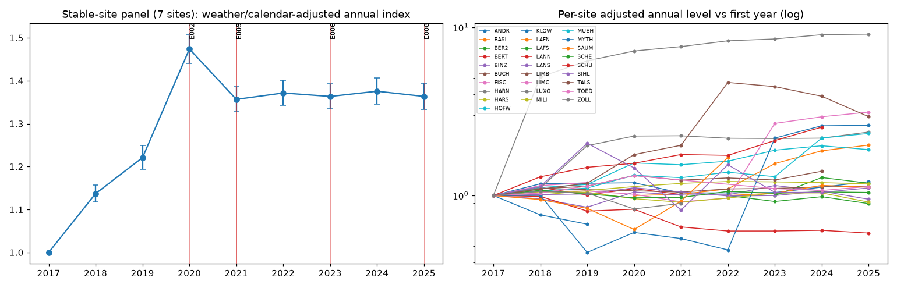

# Historical counts: descriptive stable-panel analysis

Weather- and calendar-adjusted Poisson GLM on full-day totals. Descriptive only: no causal claims about routes or induced cycling. Static-current-network caveat does not apply here (no network used). Pandemic periods are not modelled separately; read 2020-2021 with care.

Stable sites (2017-2025, >= 250 full days/year): VZS_HARN, VZS_HARS, VZS_HOFW, VZS_LANN, VZS_LUXG, VZS_MILI, VZS_MUEH

## Adjusted annual index (first year = 1)
|   year |   adjusted_index |   ci_lo |   ci_hi |
|-------:|-----------------:|--------:|--------:|
|   2017 |            1     |   1     |   1     |
|   2018 |            1.137 |   1.118 |   1.156 |
|   2019 |            1.221 |   1.194 |   1.249 |
|   2020 |            1.474 |   1.44  |   1.509 |
|   2021 |            1.357 |   1.328 |   1.386 |
|   2022 |            1.372 |   1.342 |   1.401 |
|   2023 |            1.363 |   1.334 |   1.394 |
|   2024 |            1.376 |   1.345 |   1.407 |
|   2025 |            1.363 |   1.333 |   1.394 |

## Shares
|   year |   weekend_share_of_daily_mean |   peak_share |
|-------:|------------------------------:|-------------:|
|   2017 |                         0.682 |        0.352 |
|   2018 |                         0.716 |        0.348 |
|   2019 |                         0.671 |        0.366 |
|   2020 |                         0.724 |        0.345 |
|   2021 |                         0.73  |        0.343 |
|   2022 |                         0.687 |        0.357 |
|   2023 |                         0.663 |        0.365 |
|   2024 |                         0.672 |        0.367 |
|   2025 |                         0.682 |        0.366 |

### VZS_BASL
| site     |   year |   index_vs_first_year |   base_year |   n_days |   devices |
|:---------|-------:|----------------------:|------------:|---------:|----------:|
| VZS_BASL |   2020 |                 1     |        2020 |      166 |         1 |
| VZS_BASL |   2021 |                 1.017 |        2020 |      363 |         1 |
| VZS_BASL |   2022 |                 1.095 |        2020 |      363 |         1 |
| VZS_BASL |   2023 |                 1.549 |        2020 |      363 |         1 |
| VZS_BASL |   2024 |                 1.846 |        2020 |      364 |         1 |
| VZS_BASL |   2025 |                 1.996 |        2020 |      336 |         1 |

### VZS_LANN
| site     |   year |   index_vs_first_year |   base_year |   n_days |   devices |
|:---------|-------:|----------------------:|------------:|---------:|----------:|
| VZS_LANN |   2017 |                 1     |        2017 |      348 |         5 |
| VZS_LANN |   2018 |                 0.988 |        2017 |      307 |         5 |
| VZS_LANN |   2019 |                 0.808 |        2017 |      252 |         5 |
| VZS_LANN |   2020 |                 0.829 |        2017 |      362 |         5 |
| VZS_LANN |   2021 |                 0.651 |        2017 |      363 |         5 |
| VZS_LANN |   2022 |                 0.615 |        2017 |      363 |         5 |
| VZS_LANN |   2023 |                 0.615 |        2017 |      363 |         5 |
| VZS_LANN |   2024 |                 0.621 |        2017 |      364 |         5 |
| VZS_LANN |   2025 |                 0.598 |        2017 |      362 |         5 |

### VZS_LANS
| site     |   year |   index_vs_first_year |   base_year |   n_days |   devices |
|:---------|-------:|----------------------:|------------:|---------:|----------:|
| VZS_LANS |   2017 |                 1     |        2017 |      361 |         6 |
| VZS_LANS |   2018 |                 1.014 |        2017 |      322 |         6 |
| VZS_LANS |   2019 |                 1.021 |        2017 |      363 |         6 |
| VZS_LANS |   2020 |                 1.112 |        2017 |      362 |         6 |
| VZS_LANS |   2022 |                 0.994 |        2017 |      301 |         6 |
| VZS_LANS |   2023 |                 1     |        2017 |      362 |         6 |
| VZS_LANS |   2024 |                 1.062 |        2017 |      364 |         6 |
| VZS_LANS |   2025 |                 0.95  |        2017 |      361 |         6 |

### VZS_LAFN
| site     |   year |   index_vs_first_year |   base_year |   n_days |   devices |
|:---------|-------:|----------------------:|------------:|---------:|----------:|
| VZS_LAFN |   2022 |                 1     |        2022 |      363 |         1 |
| VZS_LAFN |   2023 |                 1.033 |        2022 |      363 |         1 |
| VZS_LAFN |   2024 |                 1.15  |        2022 |      364 |         1 |
| VZS_LAFN |   2025 |                 1.12  |        2022 |      360 |         1 |

### VZS_LAFS
| site     |   year |   index_vs_first_year |   base_year |   n_days |   devices |
|:---------|-------:|----------------------:|------------:|---------:|----------:|
| VZS_LAFS |   2022 |                 1     |        2022 |      363 |         1 |
| VZS_LAFS |   2023 |                 0.922 |        2022 |      363 |         1 |
| VZS_LAFS |   2024 |                 0.984 |        2022 |      364 |         1 |
| VZS_LAFS |   2025 |                 0.895 |        2022 |      362 |         1 |

