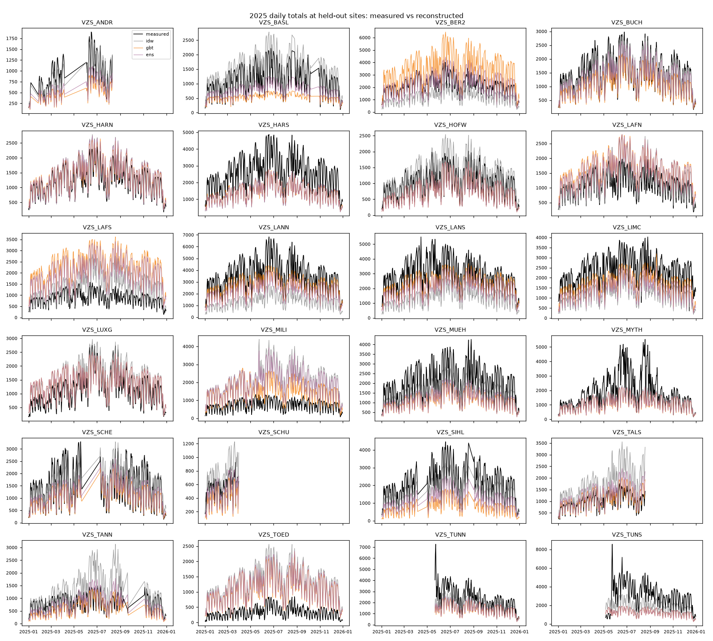
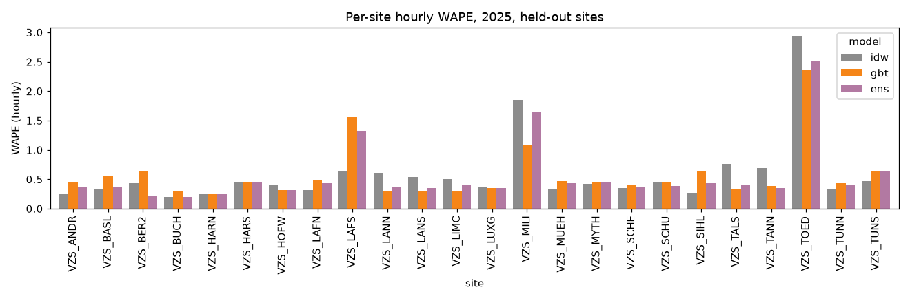
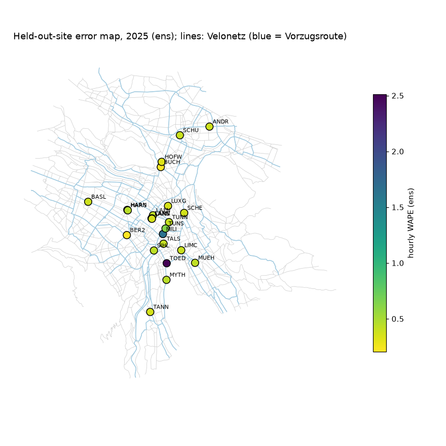

# Held-out-counter backtest: `blend`

Retrospective **spatial reconstruction** of 2025 hourly bicycle passages at each held-out city counter from contemporaneous counts at the other counters, weather, calendar and network covariates. Raw recorded passages (no correction factors). Static current OSM network. Not a forecast.

Folds: 20 hold-out groups; evaluation hours: complete, non-DST-ambiguous, non-flagged; all models compared on identical site-hours.

## Aggregate (pooled over all held-out site-hours)
| model   |      n |   MAE |   RMSE |   bias |   WAPE |   mean_obs |
|:--------|-------:|------:|-------:|-------:|-------:|-----------:|
| idw     | 184263 | 33.43 |  55.72 |  -9.56 |   0.49 |      68.73 |
| gbt     | 184263 | 33.07 |  56.15 |  -9.59 |   0.48 |      68.73 |
| ens     | 184263 | 31.14 |  52.81 | -10.18 |   0.45 |      68.73 |

## Macro average across sites
| model   |   MAE |   RMSE |   bias |   WAPE |
|:--------|------:|-------:|-------:|-------:|
| idw     | 32.23 |  47.51 |  -8.94 |   0.59 |
| gbt     | 32.43 |  49.68 | -11.23 |   0.58 |
| ens     | 30.49 |  46.41 | -11.23 |   0.56 |

## Daily totals (days with 24 evaluated hours)
| model   |    n |    MAE |    RMSE |    bias |   WAPE |   mean_obs |
|:--------|-----:|-------:|--------:|--------:|-------:|-----------:|
| idw     | 7627 | 749.41 | 1012.46 | -229.27 |   0.45 |    1651.59 |
| gbt     | 7627 | 739.57 |  968.3  | -230.46 |   0.45 |    1651.59 |
| ens     | 7627 | 691.56 |  920.71 | -244.35 |   0.42 |    1651.59 |

## Validation (2024, validation sites) MAE, mean over folds
|     |   val_MAE |
|:----|----------:|
| idw |     30.03 |
| gbt |     28.77 |
| ens |     27.88 |

## Prediction-interval coverage (intervals from validation residuals)
| model   |   nominal 80% |   nominal 90% |
|:--------|--------------:|--------------:|
| idw     |         0.694 |         0.772 |
| gbt     |         0.743 |         0.845 |
| ens     |         0.737 |         0.838 |

## Week-block bootstrap of pooled MAE differences (95% CI)
|                |   mae_diff_a_minus_b |   ci95_lo |   ci95_hi |
|:---------------|---------------------:|----------:|----------:|
| ('gbt', 'idw') |                -0.36 |     -0.8  |      0.11 |
| ('ens', 'idw') |                -2.29 |     -2.66 |     -1.92 |
| ('ens', 'gbt') |                -1.94 |     -2.13 |     -1.74 |

## By season
| season        |   ('MAE', 'ens') |   ('MAE', 'gbt') |   ('MAE', 'idw') |   ('WAPE', 'ens') |   ('WAPE', 'gbt') |   ('WAPE', 'idw') |   ('bias', 'ens') |   ('bias', 'gbt') |   ('bias', 'idw') |
|:--------------|-----------------:|-----------------:|-----------------:|------------------:|------------------:|------------------:|------------------:|------------------:|------------------:|
| spring/autumn |            31.59 |            33.91 |            33.81 |              0.45 |              0.48 |              0.48 |            -10.36 |             -9.48 |            -10.44 |
| summer        |            40.26 |            41.83 |            43.16 |              0.47 |              0.48 |              0.5  |            -13.87 |            -14.46 |             -9.86 |
| winter        |            20.7  |            22.27 |            22.48 |              0.44 |              0.48 |              0.48 |             -5.96 |             -4.71 |             -7.54 |

## By daytype
| daytype         |   ('MAE', 'ens') |   ('MAE', 'gbt') |   ('MAE', 'idw') |   ('WAPE', 'ens') |   ('WAPE', 'gbt') |   ('WAPE', 'idw') |   ('bias', 'ens') |   ('bias', 'gbt') |   ('bias', 'idw') |
|:----------------|-----------------:|-----------------:|-----------------:|------------------:|------------------:|------------------:|------------------:|------------------:|------------------:|
| weekend/holiday |            23.21 |            23.49 |            26.95 |              0.48 |              0.49 |              0.56 |             -6.31 |             -6.06 |             -5.75 |
| workday         |            34.7  |            37.38 |            36.34 |              0.44 |              0.48 |              0.47 |            -11.92 |            -11.18 |            -11.27 |

## By peak
| peak     |   ('MAE', 'ens') |   ('MAE', 'gbt') |   ('MAE', 'idw') |   ('WAPE', 'ens') |   ('WAPE', 'gbt') |   ('WAPE', 'idw') |   ('bias', 'ens') |   ('bias', 'gbt') |   ('bias', 'idw') |
|:---------|-----------------:|-----------------:|-----------------:|------------------:|------------------:|------------------:|------------------:|------------------:|------------------:|
| off-peak |            23.58 |            24.52 |            26.54 |              0.46 |              0.47 |              0.51 |             -6.83 |             -6.31 |             -6.82 |
| peak     |            76.17 |            84.02 |            74.45 |              0.45 |              0.49 |              0.44 |            -30.12 |            -29.14 |            -25.88 |

## By stadttunnel
| stadttunnel       |   ('MAE', 'ens') |   ('MAE', 'gbt') |   ('MAE', 'idw') |   ('WAPE', 'ens') |   ('WAPE', 'gbt') |   ('WAPE', 'idw') |   ('bias', 'ens') |   ('bias', 'gbt') |   ('bias', 'idw') |
|:------------------|-----------------:|-----------------:|-----------------:|------------------:|------------------:|------------------:|------------------:|------------------:|------------------:|
| after 22 May 2025 |            34.34 |            36.26 |            36.08 |              0.46 |              0.48 |              0.48 |            -10.99 |            -11.04 |             -9.12 |
| before            |            26.03 |            28    |            29.2  |              0.44 |              0.48 |              0.5  |             -8.89 |             -7.28 |            -10.27 |

## Per-site hourly MAE
| site     |   idw |   gbt |   ens |
|:---------|------:|------:|------:|
| VZS_ANDR |  9.54 | 17.08 | 13.91 |
| VZS_BASL | 15.35 | 25.74 | 17.59 |
| VZS_BER2 | 37.98 | 56.38 | 18.46 |
| VZS_BUCH | 11.83 | 18.01 | 12.43 |
| VZS_HARN | 12.51 | 12.6  | 12.41 |
| VZS_HARS | 49.53 | 49.45 | 49.48 |
| VZS_HOFW | 16.45 | 13.06 | 13.06 |
| VZS_LAFN | 14.07 | 21.83 | 19.48 |
| VZS_LAFS | 22.72 | 55.89 | 47.3  |
| VZS_LANN | 90.38 | 42.36 | 52.9  |
| VZS_LANS | 66.71 | 37.33 | 43.25 |
| VZS_LIMC | 49.11 | 29.88 | 39.14 |
| VZS_LUXG | 17.5  | 16.82 | 16.82 |
| VZS_MILI | 55.83 | 32.83 | 50.02 |
| VZS_MUEH | 27.01 | 39.21 | 35.98 |
| VZS_MYTH | 33.03 | 35.83 | 34.97 |
| VZS_SCHE | 22.25 | 24.72 | 22.66 |
| VZS_SCHU | 10.66 | 10.67 |  9.12 |
| VZS_SIHL | 23.62 | 55.28 | 38.14 |
| VZS_TALS | 31.99 | 13.94 | 17.2  |
| VZS_TANN | 22.9  | 12.85 | 11.66 |
| VZS_TOED | 40.18 | 32.45 | 34.38 |
| VZS_TUNN | 33.07 | 43.8  | 41.06 |
| VZS_TUNS | 59.38 | 80.42 | 80.42 |

## Difficult sites (highest best-model MAE)
| site     |   best MAE |
|:---------|-----------:|
| VZS_TUNS |      59.38 |
| VZS_HARS |      49.45 |
| VZS_LANN |      42.36 |
| VZS_LANS |      37.33 |
| VZS_TUNN |      33.07 |

