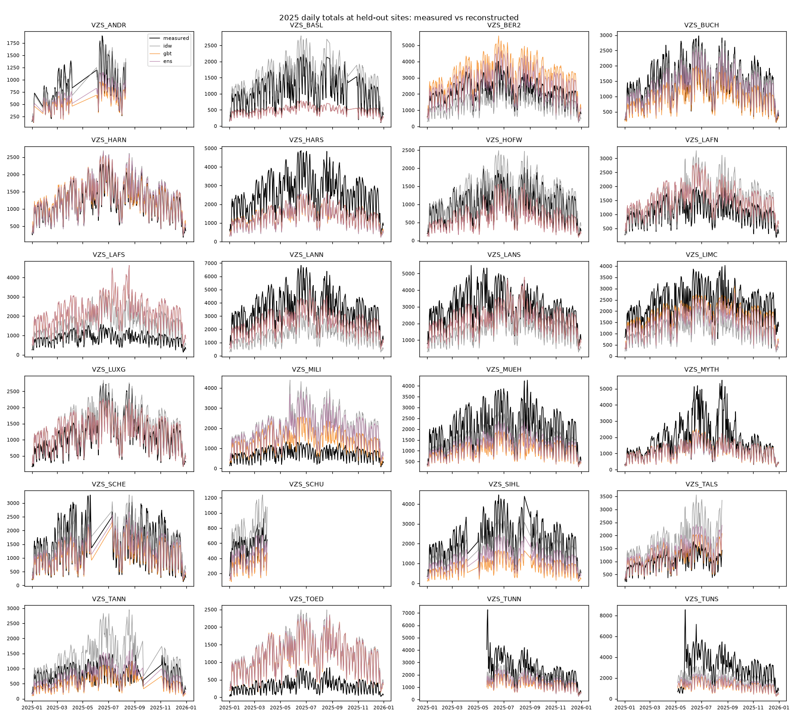
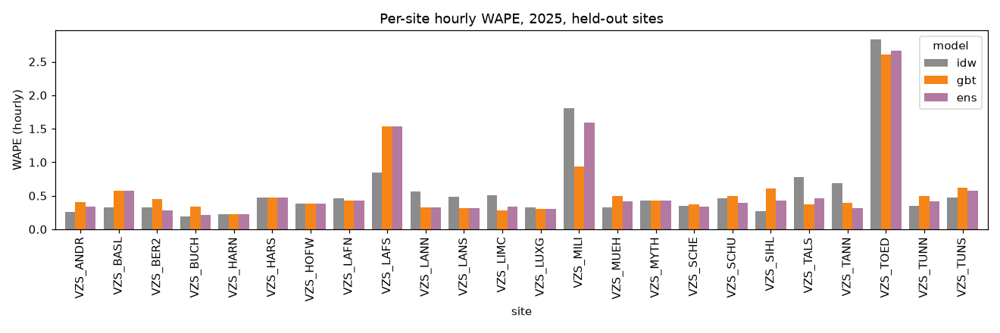
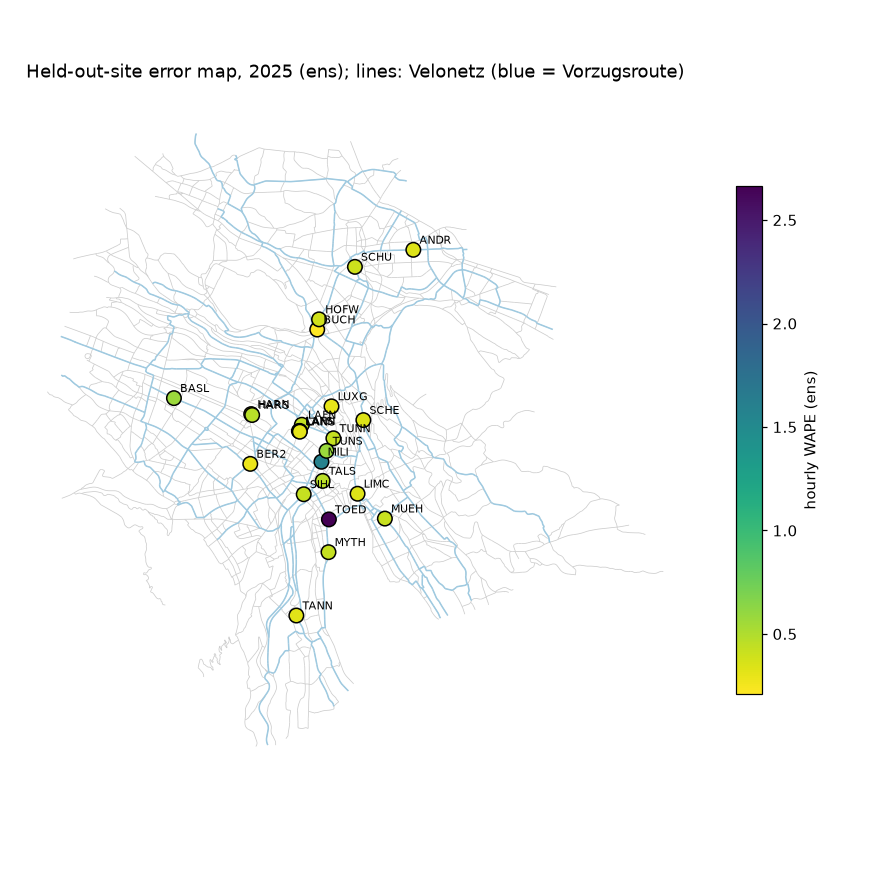

# Held-out-counter backtest: `blend_velonetz`

Retrospective **spatial reconstruction** of 2025 hourly bicycle passages at each held-out city counter from contemporaneous counts at the other counters, weather, calendar and network covariates. Raw recorded passages (no correction factors). Static current OSM network. Not a forecast.

Folds: 20 hold-out groups; evaluation hours: complete, non-DST-ambiguous, non-flagged; all models compared on identical site-hours.

## Aggregate (pooled over all held-out site-hours)
| model   |      n |   MAE |   RMSE |   bias |   WAPE |   mean_obs |
|:--------|-------:|------:|-------:|-------:|-------:|-----------:|
| idw     | 184263 | 33.03 |  54.46 |  -8.29 |   0.48 |      68.73 |
| gbt     | 184263 | 32.52 |  54.28 | -11.72 |   0.47 |      68.73 |
| ens     | 184263 | 31.15 |  51.94 |  -8.91 |   0.45 |      68.73 |

## Macro average across sites
| model   |   MAE |   RMSE |   bias |   WAPE |
|:--------|------:|-------:|-------:|-------:|
| idw     | 31.95 |  47.21 |  -7.81 |   0.59 |
| gbt     | 32.01 |  48.46 | -13.13 |   0.58 |
| ens     | 30.44 |  46.13 | -10.02 |   0.57 |

## Daily totals (days with 24 evaluated hours)
| model   |    n |    MAE |   RMSE |    bias |   WAPE |   mean_obs |
|:--------|-----:|-------:|-------:|--------:|-------:|-----------:|
| idw     | 7627 | 739.88 | 983.67 | -198.72 |   0.45 |    1651.59 |
| gbt     | 7627 | 726.06 | 946.45 | -281.58 |   0.44 |    1651.59 |
| ens     | 7627 | 689.08 | 905.34 | -213.9  |   0.42 |    1651.59 |

## Validation (2024, validation sites) MAE, mean over folds
|     |   val_MAE |
|:----|----------:|
| idw |     30.06 |
| gbt |     28.62 |
| ens |     27.69 |

## Prediction-interval coverage (intervals from validation residuals)
| model   |   nominal 80% |   nominal 90% |
|:--------|--------------:|--------------:|
| idw     |         0.69  |         0.771 |
| gbt     |         0.741 |         0.849 |
| ens     |         0.743 |         0.844 |

## Week-block bootstrap of pooled MAE differences (95% CI)
|                |   mae_diff_a_minus_b |   ci95_lo |   ci95_hi |
|:---------------|---------------------:|----------:|----------:|
| ('gbt', 'idw') |                -0.51 |     -0.88 |     -0.12 |
| ('ens', 'idw') |                -1.89 |     -2.2  |     -1.55 |
| ('ens', 'gbt') |                -1.37 |     -1.5  |     -1.24 |

## By season
| season        |   ('MAE', 'ens') |   ('MAE', 'gbt') |   ('MAE', 'idw') |   ('WAPE', 'ens') |   ('WAPE', 'gbt') |   ('WAPE', 'idw') |   ('bias', 'ens') |   ('bias', 'gbt') |   ('bias', 'idw') |
|:--------------|-----------------:|-----------------:|-----------------:|------------------:|------------------:|------------------:|------------------:|------------------:|------------------:|
| spring/autumn |            31.64 |            33.21 |            33.37 |              0.45 |              0.47 |              0.47 |             -9.48 |            -12.18 |             -9.19 |
| summer        |            40.34 |            41.61 |            42.81 |              0.47 |              0.48 |              0.5  |            -11.21 |            -15.51 |             -8.21 |
| winter        |            20.56 |            21.65 |            22.11 |              0.44 |              0.46 |              0.47 |             -5.39 |             -6.87 |             -6.64 |

## By daytype
| daytype         |   ('MAE', 'ens') |   ('MAE', 'gbt') |   ('MAE', 'idw') |   ('WAPE', 'ens') |   ('WAPE', 'gbt') |   ('WAPE', 'idw') |   ('bias', 'ens') |   ('bias', 'gbt') |   ('bias', 'idw') |
|:----------------|-----------------:|-----------------:|-----------------:|------------------:|------------------:|------------------:|------------------:|------------------:|------------------:|
| weekend/holiday |            23.11 |            23.4  |            26.56 |              0.48 |              0.49 |              0.55 |             -5.32 |             -7.58 |             -4.84 |
| workday         |            34.76 |            36.62 |            35.94 |              0.45 |              0.47 |              0.46 |            -10.52 |            -13.59 |             -9.83 |

## By peak
| peak     |   ('MAE', 'ens') |   ('MAE', 'gbt') |   ('MAE', 'idw') |   ('WAPE', 'ens') |   ('WAPE', 'gbt') |   ('WAPE', 'idw') |   ('bias', 'ens') |   ('bias', 'gbt') |   ('bias', 'idw') |
|:---------|-----------------:|-----------------:|-----------------:|------------------:|------------------:|------------------:|------------------:|------------------:|------------------:|
| off-peak |            23.61 |            24.48 |            26.19 |              0.46 |              0.47 |              0.51 |             -5.64 |             -7.74 |             -5.87 |
| peak     |            76.05 |            80.39 |            73.82 |              0.45 |              0.47 |              0.43 |            -28.42 |            -35.47 |            -22.66 |

## By stadttunnel
| stadttunnel       |   ('MAE', 'ens') |   ('MAE', 'gbt') |   ('MAE', 'idw') |   ('WAPE', 'ens') |   ('WAPE', 'gbt') |   ('WAPE', 'idw') |   ('bias', 'ens') |   ('bias', 'gbt') |   ('bias', 'idw') |
|:------------------|-----------------:|-----------------:|-----------------:|------------------:|------------------:|------------------:|------------------:|------------------:|------------------:|
| after 22 May 2025 |            34.37 |            35.73 |            35.79 |              0.46 |              0.48 |              0.48 |             -9.51 |            -13.12 |             -7.65 |
| before            |            26.01 |            27.39 |            28.63 |              0.44 |              0.47 |              0.49 |             -7.95 |             -9.49 |             -9.31 |

## Per-site hourly MAE
| site     |   idw |   gbt |   ens |
|:---------|------:|------:|------:|
| VZS_ANDR |  9.67 | 15.15 | 12.53 |
| VZS_BASL | 15.36 | 26.66 | 26.66 |
| VZS_BER2 | 29.14 | 39.35 | 24.88 |
| VZS_BUCH | 11.95 | 20.74 | 12.75 |
| VZS_HARN | 11.75 | 11.78 | 11.56 |
| VZS_HARS | 51.96 | 51.43 | 51.8  |
| VZS_HOFW | 15.72 | 15.99 | 15.99 |
| VZS_LAFN | 20.83 | 19.51 | 19.51 |
| VZS_LAFS | 30.26 | 54.89 | 54.89 |
| VZS_LANN | 82.23 | 47.37 | 47.37 |
| VZS_LANS | 59.35 | 38.7  | 38.7  |
| VZS_LIMC | 50.22 | 28.17 | 32.96 |
| VZS_LUXG | 15.72 | 14.33 | 14.33 |
| VZS_MILI | 54.68 | 28.34 | 48.02 |
| VZS_MUEH | 27.84 | 41.83 | 34.55 |
| VZS_MYTH | 33.61 | 33.05 | 33.18 |
| VZS_SCHE | 22.02 | 23.07 | 21.46 |
| VZS_SCHU | 10.79 | 11.51 |  9.18 |
| VZS_SIHL | 23.96 | 53.69 | 37.61 |
| VZS_TALS | 32.69 | 15.87 | 19.34 |
| VZS_TANN | 22.96 | 12.97 | 10.61 |
| VZS_TOED | 38.7  | 35.73 | 36.47 |
| VZS_TUNN | 35.24 | 49.4  | 42.26 |
| VZS_TUNS | 60.25 | 78.6  | 73.94 |

## Difficult sites (highest best-model MAE)
| site     |   best MAE |
|:---------|-----------:|
| VZS_TUNS |      60.25 |
| VZS_HARS |      51.43 |
| VZS_LANN |      47.37 |
| VZS_LANS |      38.7  |
| VZS_TOED |      35.73 |

