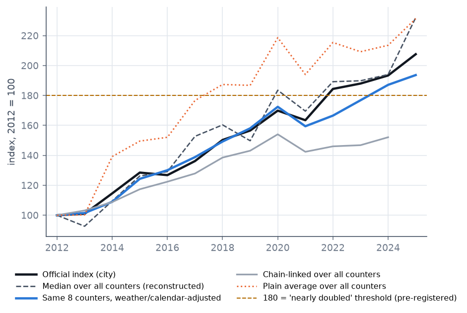
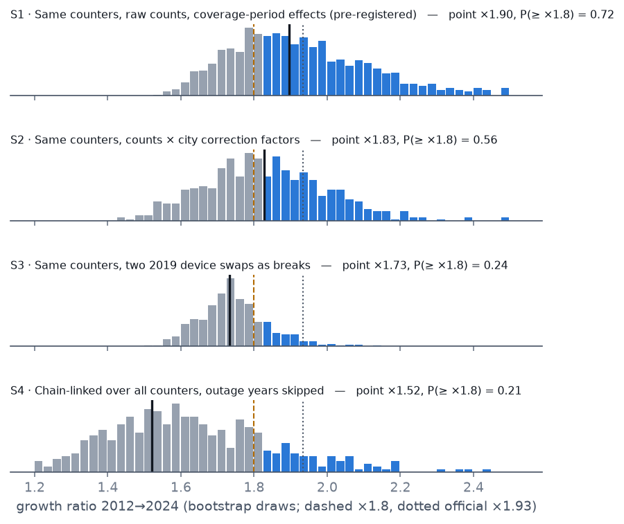
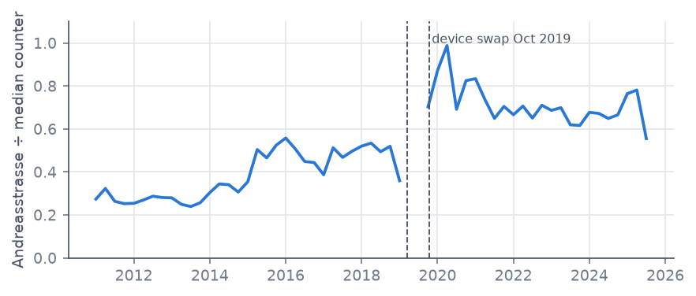
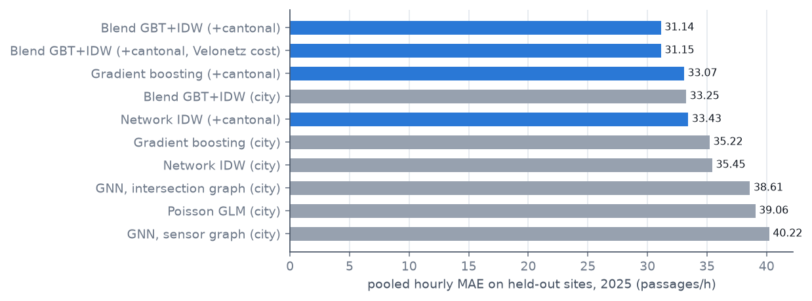
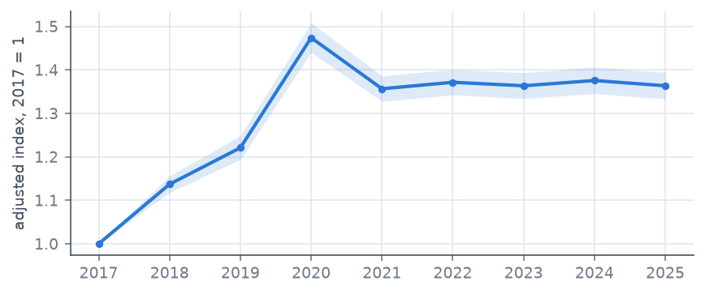

<!-- Generated by `zh-cycling figures` from paper.src.md. Edit that file, not this one. -->

# Did cycling in Zurich nearly double? Checking a city claim against its own open counter data

*Manuel Trachsler · October 2026 · preprint, not peer reviewed*

**Abstract.** The City of Zurich reports that cycling "nearly doubled" between 2012 and 2024, based on an index that averages all bicycle counters active in each year. We rebuild that index from the city's open counter data and re-estimate growth like-for-like on the 8 counters that operated in both years, adjusting for weather and calendar. The official figure ($`\times 1.93`$) is reproducible ($`\times 1.94`$ with a median over counters), and strong growth is not in doubt. Whether it reaches "nearly doubled" ($`r \geq 1.8`$, fixed before estimation) depends on how one device change in 2019 is treated: the pre-registered estimate is $`\hat r = 1.90`$ (95% CI 1.63–2.37), giving a confidence of $`\hat p = 0.72`$, with a range of 0.21–0.72 across four analysis choices. A secondary analysis shows that hourly counts at an unmeasured location can be reconstructed from the other counters only to about 45% weighted absolute error.


## 1. Introduction

- Public cycling statistics are used to justify infrastructure spending; Zurich's
  index is cited by the city and by advocacy groups (Pro Velo, Nov 2025).
- The index averages whatever counters exist each year. Counters were added,
  replaced and moved, so growth and network composition are mixed.
- Questions: (i) can the published figure be reproduced from open data,
  (ii) how much of it survives a like-for-like comparison, (iii) how confident
  can one be that cycling "nearly doubled".

## 2. Data

- City counter observations 2009–2026 (15-minute, both directions), device and
  correction-factor metadata, MeteoSwiss hourly weather, calendar. See
  `DATA_SOURCES.md`.
- Counters in the city index: 11 in 2012, 23 in 2024
  (sites with at least 250 complete days).
- Cleaning: physical site vs device period, autumn DST duplicates, partial hours,
  zero runs (README, "Technical notes on the data").

## 3. Methods

### 3.1 Reproducing the official index

Let $`\bar y_{st}`$ be the mean daily count of counter $`s`$ in year $`t`$, and $`S_t`$ the
set of counters active in year $`t`$. We compare several aggregation rules with the
official index $`I_t`$, for example the median rule

```math
\hat I_t = 100 \cdot \frac{\mathrm{median}_{s \in S_t} \bar y_{st}}{\mathrm{median}_{s \in S_{2012}} \bar y_{s,2012}},
```

by the root-mean-square difference over 2012–2025 (best: 9.3 index points).

| method                              |   RMSE (index points) |   2024 value |
|:------------------------------------|----------------------:|-------------:|
| median_of_site_means_raw            |                   9.3 |        200.5 |
| median_of_site_means_corrected_250d |                   9.9 |        194.0 |
| median_of_site_means_corrected      |                  13.2 |        206.9 |
| median_of_site_means_raw_250d       |                  14.7 |        176.4 |
| mean_of_site_means_corrected_250d   |                  28.4 |        213.6 |
| mean_of_site_means_corrected        |                  31.2 |        219.9 |
| pooled_site_days_corrected          |                  31.2 |        217.2 |
| mean_of_site_means_raw_250d         |                  34.4 |        227.1 |
| pooled_site_days_raw                |                  38.3 |        231.1 |
| mean_of_site_means_raw              |                  39.0 |        234.1 |


### 3.2 Like-for-like growth

For the 8 counters observed in both 2012 and 2024, the daily total
$`y_{sd}`$ of counter $`s`$ on day $`d`$ is modelled as

```math
y_{sd} \sim \mathrm{Poisson}(\mu_{sd}), \qquad
\log \mu_{sd} = \alpha_{c(s,d)} + \gamma_{t(d)} + \mathbf{x}_d^{\top} \beta,
```

where $`c(s,d)`$ is the coverage period (consecutive device periods sharing a
correction factor), $`t(d)`$ the year and $`\mathbf{x}_d`$ the weather and calendar
covariates (temperature and its square, $`\log(1+\text{precipitation})`$, sunshine,
weekday, public and school holidays, month). The growth ratio is

```math
r = \exp\left(\gamma_{2024} - \gamma_{2012}\right).
```

The chain-linked variant multiplies consecutive-year ratios, each fitted on the
counters observed in both years:
$`r^{\text{chain}} = \prod_{t=2012}^{2023} \exp\left(\hat\gamma^{(t)}_{t+1} - \hat\gamma^{(t)}_{t}\right)`$.
Table 1 lists the four scenarios.

### 3.3 Test definition and confidence, fixed in advance

"Nearly doubled" is defined as $`r \geq 1.8`$. Uncertainty comes from a
two-stage cluster bootstrap: resample counters with replacement, then ISO-week
blocks, and refit. With $`B = 1000`$ draws $`r^{\ast}_1, \dots, r^{\ast}_B`$ under
the pre-registered scenario S1, the reported confidence is

```math
\hat p = \frac{1}{B} \sum_{b=1}^{B} \mathbf{1}\left[ r^{\ast}_b \geq 1.8 \right].
```

### 3.4 Anomaly inventory

For a device swap at counter $`s`$ on date $`\tau`$, the step relative to the other
counters is

```math
\Delta_s = \left( \overline{\log y}_{s}^{\,\text{after}} - \overline{\log y}_{s}^{\,\text{before}} \right)
- \mathrm{median}_{s' \neq s} \left( \overline{\log y}_{s'}^{\,\text{after}} - \overline{\log y}_{s'}^{\,\text{before}} \right),
```

using 120-day windows on either side of $`\tau`$; we report $`e^{\Delta_s}`$. Year-to-year
jumps of a counter's level relative to the median counter beyond a factor of 1.25
are flagged. Anomalies are grouped by cause: A measurement breaks, B temporary
disruptions, C city-wide events, D real local change, E counter mix.

## 4. Results

### 4.1 The official figure is reproducible



### 4.2 Like-for-like growth and confidence

The same 8 counters grew $`\times 1.79`$ unadjusted and
$`\hat r = 1.90`$ adjusted. Strong growth is robust:
$`P(r \geq 1.5) = 1.00`$, while $`\hat p = P(r \geq 1.8) = 0.72`$.

| scenario   | description                                                         |   point |   CI 2.5% |   CI 97.5% |   P(≥×1.5) |   P(≥×1.8) |   P(≥×1.934) |   draws |
|:-----------|:--------------------------------------------------------------------|--------:|----------:|-----------:|-----------:|-----------:|-------------:|--------:|
| S1         | Same counters, raw counts, coverage-period effects (pre-registered) |    1.90 |      1.63 |       2.37 |       1.00 |       0.72 |         0.43 |    1000 |
| S2         | Same counters, counts × city correction factors                     |    1.83 |      1.54 |       2.21 |       0.99 |       0.56 |         0.26 |     500 |
| S3         | Same counters, two 2019 device swaps as breaks                      |    1.73 |      1.58 |       1.96 |       1.00 |       0.24 |         0.04 |     500 |
| S4         | Chain-linked over all counters, outage years skipped                |    1.52 |      1.28 |       2.12 |       0.71 |       0.21 |         0.10 |     452 |




### 4.3 One counter carries the margin

Leaving one counter out gives $`\hat r \in [1.79, 2.05]`$;
without Andreasstrasse $`\hat r = 1.79`$. Treating its October 2019
device swap as a break gives $`\hat r = 1.79`$.



| group   | anomaly                                                    | sites                                                                     |   same-8 ratio |   change % |   city median if excluded | changes verdict        |
|:--------|:-----------------------------------------------------------|:--------------------------------------------------------------------------|---------------:|-----------:|--------------------------:|:-----------------------|
| A       | Andreasstrasse device swap Oct 2019 as a break             | VZS_ANDR                                                                  |           1.79 |      -5.35 |                      1.70 | yes                    |
| A       | Hofwiesenstrasse device swap Mar 2019 as a break           | VZS_HOFW                                                                  |           1.85 |      -2.57 |                      1.70 | no                     |
| A       | Both 2019 swaps as breaks (scenario S3)                    | VZS_ANDR, VZS_HOFW                                                        |           1.73 |      -8.64 |                    nan    | yes                    |
| A       | Correction-factor changes not split into periods           | VZS_MUEH 2023, VZS_MYTH 2022, VZS_SIHL 2022                               |           1.86 |      -1.74 |                    nan    | no                     |
| A       | Device or factor steps at counters added later             | VZS_SCHU, VZS_LIMC, VZS_BUCH, VZS_TOED, VZS_HARN                          |         nan    |     nan    |                      2.15 | city-style figure only |
| B       | Roadworks and outage years dropped                         | VZS_SIHL 2020, VZS_SIHL 2021, VZS_MYTH 2022, VZS_SCHE 2019, VZS_BINZ 2022 |           1.88 |      -0.98 |                    nan    | no                     |
| C       | COVID years 2020-21 dropped                                | all                                                                       |           1.94 |       2.55 |                    nan    | no                     |
| D       | Gradual ramps treated as breaks (wrong in principle)       | VZS_ANDR 2014-16, VZS_MUEH 2014-15                                        |           1.72 |      -9.30 |                    nan    | yes                    |
| D       | Documented route effects excluded                          | VZS_BASL, VZS_LANN, VZS_LANS, VZS_LAFN, VZS_LAFS                          |         nan    |     nan    |                      2.16 | city-style figure only |
| D       | Unexplained persistent step without device change excluded | VZS_TALS                                                                  |         nan    |     nan    |                      1.93 | city-style figure only |


### 4.4 Composition and the fragility of the median

For a plain average over all counters, the growth ratio splits exactly into
like-for-like growth and a counter-mix term ("stay" = counters active in both years):

```math
\frac{\bar y^{\,\text{all}}_{2024}}{\bar y^{\,\text{all}}_{2012}}
= \underbrace{\frac{\bar y^{\,\text{stay}}_{2024}}{\bar y^{\,\text{stay}}_{2012}}}_{\text{same counters}}
\times \underbrace{\frac{\bar y^{\,\text{all}}_{2024} / \bar y^{\,\text{stay}}_{2024}}{\bar y^{\,\text{all}}_{2012} / \bar y^{\,\text{stay}}_{2012}}}_{\text{counter mix}},
\qquad 2.14 = 1.75 \times 1.22.
```

The city's median is far less exposed to composition, but with 11
counters in 2012, dropping any one moves it between $`\times 1.53`$
and $`\times 2.16`$.

## 5. Secondary analysis: reconstructing counts at unmeasured locations

Held-out-site backtest, test year 2025. Errors are reported as
$`\text{MAE} = \frac{1}{n}\sum_i |y_i - \hat y_i|`$ and
$`\text{WAPE} = \sum_i |y_i - \hat y_i| \,/\, \sum_i y_i`$ over held-out site-hours.
The best model is a validation-weighted blend of gradient boosting and
network-distance IDW, $`\hat y = w\,\hat y^{\text{GBT}} + (1-w)\,\hat y^{\text{IDW}}`$ with
$`w`$ chosen per fold on validation sites, using 29 cantonal stations as extra
inputs: pooled hourly MAE 31.1 passages/h (city-only 33.2),
daily-total WAPE 42%, 90% interval coverage 84%.
An inductive GNN was 5.6–7.2 passages/h worse than
gradient boosting and was not selected. Routing along the planned Velonetz did not
help the blend (MAE 31.1).

| model                                    |   pooled MAE |   macro MAE |   WAPE |   bias |   90% coverage |
|:-----------------------------------------|-------------:|------------:|-------:|-------:|---------------:|
| Blend GBT+IDW (+cantonal)                |        31.14 |       30.49 |   0.45 | -10.18 |           0.84 |
| Blend GBT+IDW (+cantonal, Velonetz cost) |        31.15 |       30.44 |   0.45 |  -8.91 |           0.84 |
| Gradient boosting (+cantonal)            |        33.07 |       32.43 |   0.48 |  -9.59 |           0.85 |
| Blend GBT+IDW (city)                     |        33.25 |       32.51 |   0.48 | -11.98 |           0.77 |
| Network IDW (+cantonal)                  |        33.43 |       32.23 |   0.49 |  -9.56 |           0.77 |
| Gradient boosting (city)                 |        35.22 |       34.45 |   0.51 | -15.79 |           0.80 |
| Network IDW (city)                       |        35.45 |       34.63 |   0.52 |   0.53 |           0.77 |
| GNN, intersection graph (city)           |        38.61 |       37.00 |   0.56 | -17.61 |           0.80 |
| Poisson GLM (city)                       |        39.06 |       38.01 |   0.57 | -30.93 |           0.74 |
| GNN, sensor graph (city)                 |        40.22 |       39.05 |   0.59 | -15.60 |           0.83 |




## 6. Discussion

- The city's number is defensible as a headline, but its precision is lower than
  one decimal suggests, and the like-for-like evidence supports "up about
  three-quarters to nine-tenths" more firmly than "nearly doubled".
- One question to the Tiefbauamt would resolve most of the range: whether the
  Andreasstrasse device change in October 2019 altered what is counted.
- Limitations: few long-running counters; correction factors taken as published;
  counters measure passages at a cross-section, not trips or people; static
  current network for the secondary analysis.



## Data and code availability

Code (MIT), outputs and this manuscript (CC BY 4.0):
https://github.com/MannuelTe/zh-cycling. All results are regenerated by
`scripts/reproduce.sh`.
